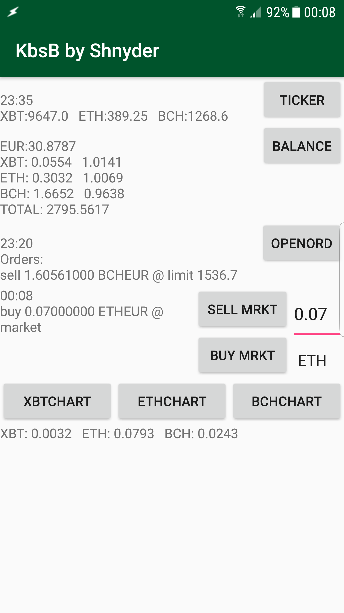

# KrakenBuySellButton
Because Kraken.com was often difficult to access, I wanted to build an app with a simple button for selling and buying at market value.
This is a quick & dirty prototype built over a weekend, so there's no two-factor authentication. Error handling is done by raw Error output, because there are lots of error sources (the reason why I made this app)

## Installation:
- Generate an API key on kraken with access rights to the ledger, the balance and the right to create orders
- copy and paste your key and secret into the static fields in class _StatString_
- compile with gradle (tested with Android Studio's built in version)

## Inside the app / functionality:
So far, trading can only be done for Bitcoin, Ethereum and Bitcoin Cash
### Top row / ticker:
Click the "ticker" button to get the latest ticker info. The displayed value is not the same as displayed in kraken's UI; it is the value of the last executed trade.
### Second row / balance:
This will not return the balance of your entire account: it will only display EUR, XBT, ETH and BCH. If ticker info exists, the three crypto currencies are multiplied with the ticker values to get the "TOTAL".
If ledger info exists, it will show what percentage the current ticker value is compared to the last buy (where 1.12 would mean 12% growth, 0.87 13% loss)
### Third row / open orders:
This will show you all of your open orders, also the ones that are not one of the three currencies mentioned above
### Sell and Buy button / volume and currency selector / return field
When you decide to buy, you click on the currency symbol (XBT at the start) to select one, and change the volume to the crypto amount you can afford with your EUR balance. Selling works similiar, amount of crypto currency to be sold to EUR
It's normal that you have to wait up to a minute for a response. If there's no response, check your open orders and balance. There is NO confirmation dialog, so be aware of double clicking! Clicking too often might lead to your kraken API key getting suspended
### how much crypto can I buy with my current EUR?
If you've got ticker and balance info, then the bottom text field will show you how much cryptocurrency you can buy if you spend all of your EUR
### three chart buttons:
These will lead you to candle charts with a one-minute interval. Be cautious: These charts are hosted in the cloud, and if they're accessible, it doesn't mean that you'll be able to sell at that point. If you have a delay of a few minutes, the market might have moved elsewhere already.

## Disclaimer:
Use at your own risk! Cryptocurrency trading itself is risky, the current ticker price will almost never be the price you'll get when trading to market value, look at the bid/ask-spread.
Technical issues: This code might not work, the cloud provider might be down, kraken's trade engine might not accept your order, there might be network issues, you might exceed kraken's requests/minute. 
Only compile and run this app if you understand the code and are willing to take the risks associated with running it.
If you redistribute this code, delete your key and secret, set both to null!

## Buy me a coffee
_If you've found this useful, feel free to send a microtransaction to this Ether-account: 0xf8bf4c9b81a208eaaa8d3642c74edde58325358c_
